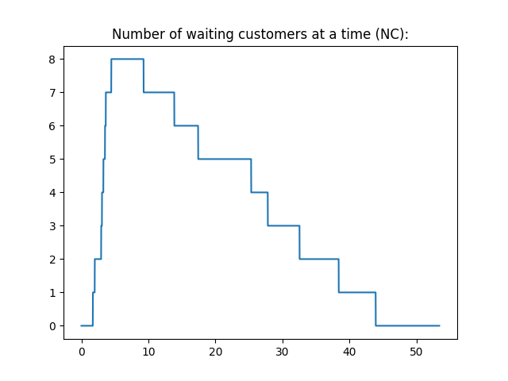
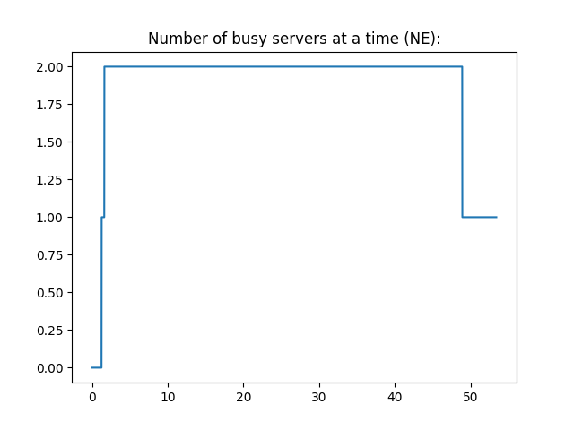

# Single Queue Simulation

## Intruduction

Implementation of single queue simulation with multiple servers and queue priority.

The parameters below are taken as input and the simulation is run based on the specified parameters:

- `NUMBER_OF_CUSTOMERS`: The number of customers in the calling population.
- `NUMBER_OF_EMPLOYEES`: THe number of employees (resources, servers, etc.) that handle customer requests.
- `PRIORITY_CHANCE`: The probability of a customer being in priority. (0-1) (defualts to 0.2)
- `LOGGING`: Whether to log the events of the system in the `out.txt` file.

## Usage

```bash
python .
```

## Sample Stats

### Charts:





### Customer Statistics:

```bash
Simulation states (first 10 rows):
   Arrival Time  Service Start  Service End  Service Time  Service Wait  Total Time  Server #
0          1.27           1.27        13.86         12.59          0.00       12.59         0
1          1.63           1.63         9.28          7.65          0.00        7.65         1
2          1.71          27.81        38.39         10.58         26.10       36.68         1
3          1.99          25.33        32.55          7.22         23.34       30.56         0
4          2.95          32.55        43.91         11.36         29.60       40.96         0
5          3.07          17.42        27.81         10.39         14.35       24.74         1
6          3.28          13.86        25.33         11.47         10.58       22.05         0
7          3.52          38.39        48.90         10.51         34.87       45.38         1
8          3.64           9.28        17.42          8.14          5.64       13.78         1
9          4.46          43.91        53.41          9.50         39.45       48.95         0
Customer stats:
       Arrival Time  Service Start  Service End  Service Time  Service Wait  Total Time
count     10.000000      10.000000     10.00000     10.000000     10.000000   10.000000
mean       2.752000      21.145000     31.08600      9.941000     18.393000   28.334000
std        1.045432      14.874369     15.04994      1.776166     14.302249   14.489606
min        1.270000       1.270000      9.28000      7.220000      0.000000    7.650000
25%        1.780000      10.425000     19.39750      8.480000      6.875000   15.847500
50%        3.010000      21.375000     30.18000     10.450000     18.845000   27.650000
75%        3.460000      31.365000     42.53000     11.165000     28.725000   39.890000
max        4.460000      43.910000     53.41000     12.590000     39.450000   48.950000
```

### Servers statistics:

```bash
Servers:
   Customers Count  Service Time  Idle Time
0                5     52.137228   1.272772
1                5     47.268062   6.141938
Servers stats:
       Customers Count  Service Time  Idle Time
count              2.0      2.000000   2.000000
mean               5.0     49.702645   3.707355
std                0.0      3.443021   3.443021
min                5.0     47.268062   1.272772
25%                5.0     48.485353   2.490063
50%                5.0     49.702645   3.707355
75%                5.0     50.919937   4.924647
max                5.0     52.137228   6.141938
```

### System events:
System Events are logged in the `out.txt` file if logging is enabled.

```bash
1.27 	 # 	 New customer arrived and queued.
1.27 	 @ 	 Customer assigned to server 1 and is set to finish in 13.86
1.63 	 # 	 New customer arrived and queued.
1.63 	 @ 	 Customer assigned to server 2 and is set to finish in 9.28
1.71 	 # 	 New customer arrived and queued.
1.99 	 # 	 New customer arrived and queued.
2.95 	 # 	 New customer arrived and queued.
3.07 	 # 	 New customer arrived and queued.
3.28 	 # 	 New customer arrived and queued.
3.52 	 # 	 New customer arrived and queued.
3.64 	 # 	 New customer arrived and queued.
4.46 	 # 	 New customer arrived and queued.
9.28 	 * 	 Server 2 finished proccessing and is free.
9.28 	 @ 	 Customer assigned to server 2 and is set to finish in 17.42
13.86 	 * 	 Server 1 finished proccessing and is free.
13.86 	 @ 	 Customer assigned to server 1 and is set to finish in 25.33
17.42 	 * 	 Server 2 finished proccessing and is free.
17.42 	 @ 	 Customer assigned to server 2 and is set to finish in 27.81
25.33 	 * 	 Server 1 finished proccessing and is free.
25.33 	 @ 	 Customer assigned to server 1 and is set to finish in 32.55
27.81 	 * 	 Server 2 finished proccessing and is free.
27.81 	 @ 	 Customer assigned to server 2 and is set to finish in 38.39
32.55 	 * 	 Server 1 finished proccessing and is free.
32.55 	 @ 	 Customer assigned to server 1 and is set to finish in 43.91
38.39 	 * 	 Server 2 finished proccessing and is free.
38.39 	 @ 	 Customer assigned to server 2 and is set to finish in 48.9
43.91 	 * 	 Server 1 finished proccessing and is free.
43.91 	 @ 	 Customer assigned to server 1 and is set to finish in 53.41
48.9 	 * 	 Server 2 finished proccessing and is free.
53.41 	 * 	 Server 1 finished proccessing and is free.
```


